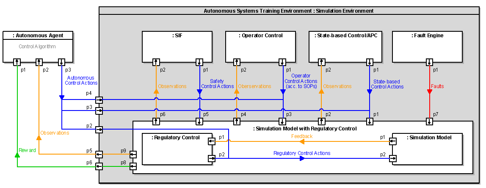
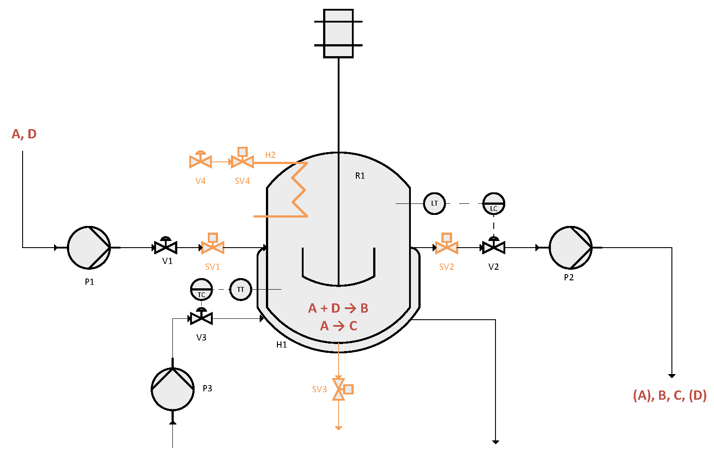
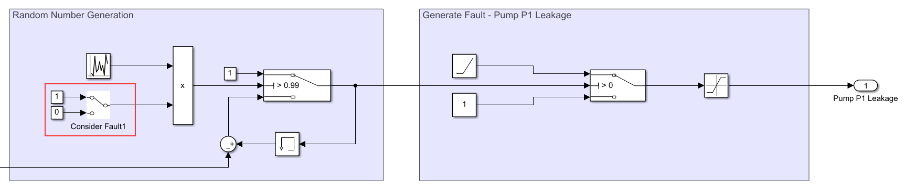

# Autonomous Systems Training Environment (ASTE) Framework

## Overview

Welcome to the Autonomous Systems Training Environment (ASTE) Framework repository! This framework is designed to provide a comprehensive platform for training and testing autonomous systems, with a focus on applications and intelligent control algorithms in autonomous process plant operations. The repository includes information on preliminaries (autonomy, autonomous systems, autonomous operations), the ASTE framework's architecture, implementation details, an exemplary use case featuring a Continuous Stirred Tank Reactor (CSTR), and instructions for deploying the framework and exemplay use case in MATLAB/Simulink.

## Table of Contents

1. [Introduction](#introduction)
2. [Architecture](#architecture)
3. [Implementation](#implementation)
   - [Exemplary Use Case: CSTR](#exemplary-use-case-cstr)
   - [Deployment in MATLAB/Simulink](#deployment-in-matlab-simulink)
4. [Contributing](#contributing)
5. [License](#license)

## Introduction

Autonomy in the sense of technical systems represents a system property characterized by *absence of human intervention, goal orientation* and *consideration of uncertainty*. Autonomous systems are a crucial aspect of modern technology, enabling technical systems to operate independently and make decisions without human intervention. In the context of process plants, autonomy plays a significant role in optimizing operations, enhancing safety, and improving efficiency. But most importantly, future shortage of skilled plant operators can be compensated by a higher degree of automation and autonomy of the plant. This repository introduces the Autonomous Systems Training Environment (ASTE) Framework, a tool designed for training and testing autonomous systems (especially intelligent process control algorithms) with a specific focus on process plant operations.

## Architecture

The architecture is based on the lower levels of the control hierarchy: process, regulatory control, advanced process control, supervisory control. In addition, the plant safety levels are assigned to these levels:
inherent safety, regulatory control, alarms and operator interventions, safety system. The logical architecture is illustrated in the figure below:

The framework is designed to support a modular and extensible structure, making it adaptable to different autonomous applications. It consists of several components, information flows and interfaces, which are described in detail below.

### Simulation Environment with Interface
On the one hand the environment provides certain values (as feedback) and rewards to the externals and on the other hand accepts control actions from externals. There exist three different control inputs: operator control actions, state-based control actions and regulatory control actions.

### Autonomous Agent with Control Algorithm
An autonomous agent acts as an external entity/computer system. It inherits a process control algorithm, which should be evaluated using the ASTE framework. It is not part of the ASTE framework, but is depicted in the logical architecture to demonstrate interactions with the framework.

### Simulation Model with Regulatory Control
This component consists of two sub-components: A model of the controlled process, respectively of the plant executing the process, and a model of the regulatory control of this process/plant. The process/plant model can be either a first-principle, empirical or hybrid model of the process/plant. It mimics process and plant behavior. A regulatory control describes basic control mechanisms based on PID controllers which receive feedback from sensors in the plant (more specifically: from the process/plant simulation model) and executes control actions (e.g., change temperature setpoint).

### Fault Engine
To test the behavior of control systems in abnormal or unusual situations, it is useful to induce these situations. For this purpose, the fault engine generates randomly generated events that directly influence the
behavior of the system.

### State-based Control The state-based control
system component is modeled as a finite state machine with different process states. In addition, start-up and shut-down processes as well as error states should be modeled. Furthermore, a distinction can be made between
automated and manual (by the operator) control.

### Operator Control
The operator control model is a human controller reflecting the behavior of a human operator to the plant. This so-called mental modeled is represented by a stochastic finite state machine containing random transitions, different operator types as well as processes for situational awareness.

### Safety Instrumented Functions (SIF)
The SIF model describes safety instrumented functions from a safety system (parallel to the regular control system). This system only intervenes in very critical situations and activates actuators (also additional actuators) to avoid hazard to man, machine and environment. This can be modeled as a rule-based system with different safety switches being activated when specific thresholds are reached.

## Implementation

### Exemplary Use Case: CSTR

To demonstrate the capabilities of the ASTE Framework, an exemplary use case involving a Continuous Stirred Tank Reactor (CSTR) is provided. The figure below illustrates the CSTR use case within the ASTE Framework:

This section details the implementation specifics, including code snippets and configurations, to showcase how the ASTE Framework can be utilized.

### Deployment in MATLAB/Simulink

The ASTE Framework is seamlessly deployable in MATLAB/Simulink environments. A subsequent implementation using a Python wrapper will be added in the future.

1. **Download the Zip Folder:**
   - Choose between the more sophisticated version or the simple version of the CSTR, and download the corresponding zip folder.

2. **Open Required Files:**
   - Open the MATLAB script: `cstrm.m`
   - Open the plotting script: `cstr_plot.m`
   - Open the Simulink model: `cstr_simulationEnv.slx`

3. **Load Initialization/Output Data:**
   - Load the initial data (init_data.mat) and output data (out_data.mat) into the simulation environment.

4. **Set Simulation Time:**
   - In the Simulink model, set the simulation time (e.g., `1000` for a duration of 1000 seconds).

5. **Choose Simulation Mode:**
   - Select either **Normal** or **Accelerator** mode. 
   - *Note: Rapid Accelerator Mode is currently unavailable.*

6. **Activate Faults:**
   - Navigate to the fault section of the Simulink model and choose which faults you want to activate during the simulation.
   - 

7. **Run the Simulation:**
   - Start the simulation by clicking the 'Run' button in Simulink.

8. **Run the Plot Script:**
   - After running the simulation, execute the plot script (`cstr_plot.m`).
   - *Tip: Adjust the axis values for the plots based on your chosen simulation time and other parameters to ensure accurate visualization.*

By following these steps, you'll be able to set up, run, and analyze the CSTR simulation with various fault conditions.

## Contributing

We welcome contributions from the community to enhance and expand the capabilities of the ASTE Framework. If you have ideas, bug reports, or feature requests, please open an issue or submit a pull request. 

Feel free to explore the repository and leverage the ASTE Framework for your autonomous systems development and training needs!

## Literature
A. Markaj, M. Mercangöz, A. Fay: Design and implementation of an Autonomous Systems Training Environment framework for control algorithm evaluation in autonomous plant operation. In: Computers & Chemical Engineering, Volume 189, October 2024, 108798. DOI: https://doi.org/10.1016/j.compchemeng.2024.108798
